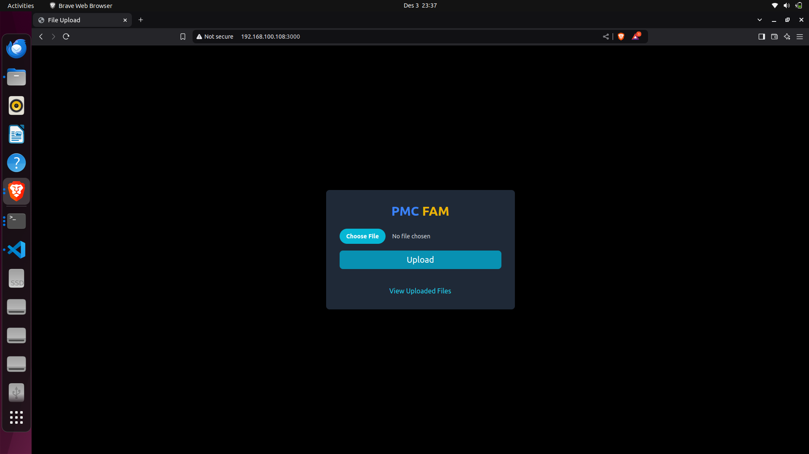
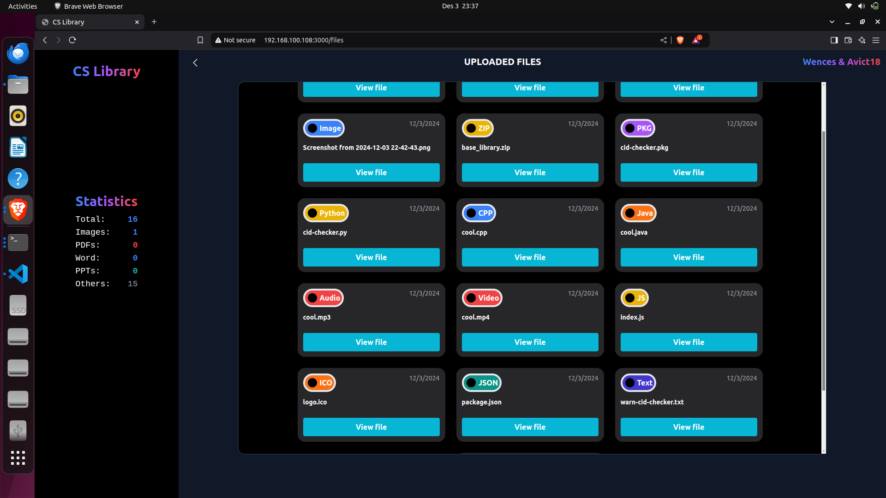

<h1 align="center"> JS-Library</h1>

<!-- ABOUT THE PROJECT -->
<h2 id="about-the-project"> About The Project</h2>

 
This is a local hosted file transer system where one device acts a s a server in the local

<!-- OVERVIEW -->
<h2 id="overview">Sceenshots</h2>

 
  

 
  

<!-- ABOUT THE PROJECT -->
<h2 id="about-the-project"> Overview</h2>

 
You simply eneter the server's ip in any of the devices in the network and enjoy the library for free

<!-- GETTING STARTED -->
<h2 id="getting-started">Getting Started</h2>

Clone the repository

<pre><code>$ git clone https://github.com/avict18/js-library</code></pre>

change directory into the project folder

<pre><code>$ cd js-library</code></pre>

Install the node packages

<pre><code>$ npm install</code></pre>

Execute the script

For Linux / Mac

<pre><code>$ bash runserver.sh</code></pre>

For Windows

<pre><code>$ runsererver.bat</code></pre>

Make sure to change the IP addresses in the script to your machines IPv4 address

<!-- CREDITS -->
<h2 id="credits">Credits</h2>

Avict18 & Wences 

## Acknowledgements:

I would like to acknowledge some few friends for challenging me to do this:

- **Jesse Charles** availiable on [**github**](https://github.com/shelby9014)
- **Justice Simon** availiable on [**github**](https://github.com/jeel-code1)